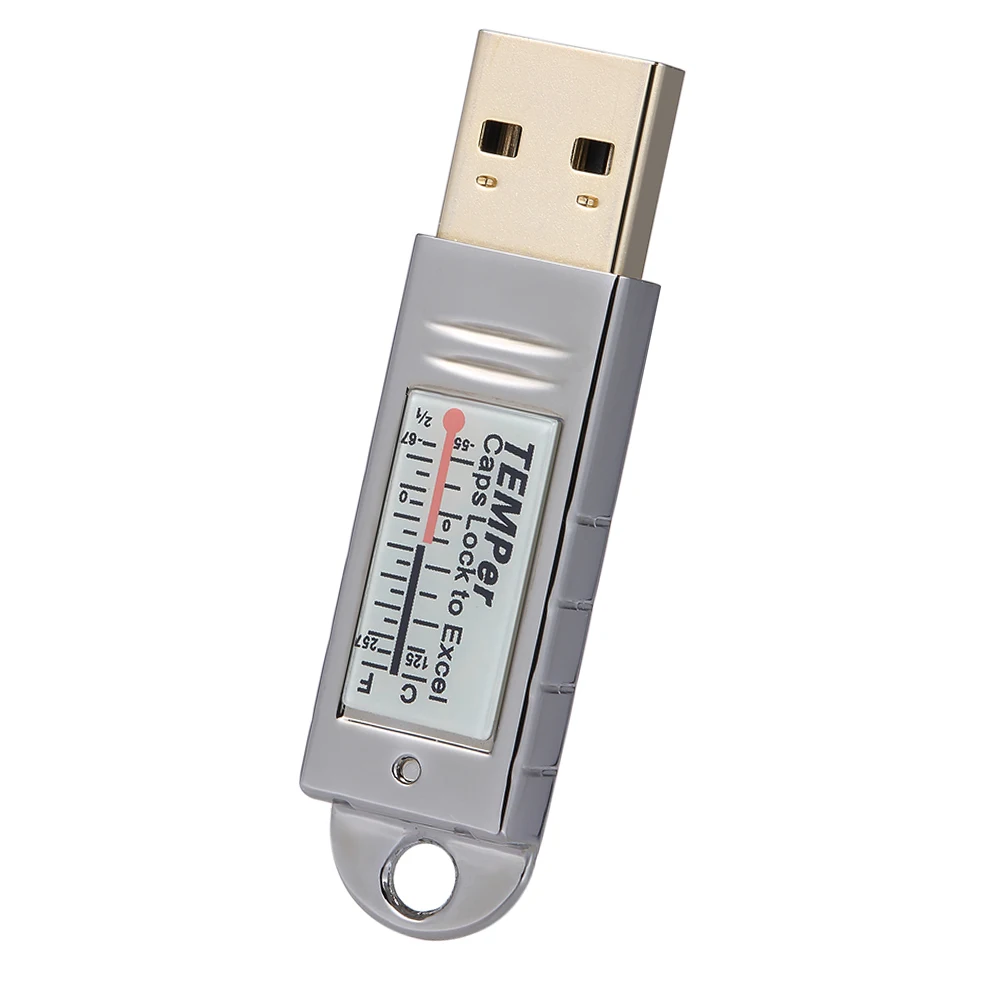

# hwmon-temper

This repo is the source code for a linux kernel module that creates a hwmon device for the PCsensor temper usb stick.

This module allows reads of /sys/class/hwmon/hwmonX/temp1_input to read the temperature in celsius from the usb stick.



## Device support

I only have a TEMPer Gold usb stick. I think it was version 3.5 or something. It didn't work with the userspace python libraries I linked below until I bumped the minor version in their code.

```
usb 3-4: new full-speed USB device number 4 using xhci_hcd
usb 3-4: New USB device found, idVendor=3553, idProduct=a001, bcdDevice= 0.00
usb 3-4: New USB device strings: Mfr=1, Product=2, SerialNumber=0
usb 3-4: Product: TEMPerGold
usb 3-4: Manufacturer: PCsensor
input: PCsensor TEMPerGold as /devices/pci0000:00/0000:00:02.1/0000:02:00.0/usb3/3-4/3-4:1.0/0003:3553:A001.0002/input/input13
```

This module divides the temp data from the by 100. There appear to be some devices that divide by 256. I don't have any of those usb sticks. Happy to accept pull requests if someone wants to patch support for multiple devices.

It looks like this usb stick is marketed towards Windows so you can double tap NumLock/CapsLock and write the temperature via keyboard input. Hence this device registers as a keyboard device. I won't be using that and don't care, so I filtered out the keyboard device in the should_load function.


## See Also

There are a couple other repos to reference that do similar to this kernel module, but in user space.

https://github.com/padelt/temper-python
https://github.com/urwen/temper

A bunch of this code was formed by hacking on bits and pieces of a number of existing linux kernel drivers for hwmon devices.

https://github.com/torvalds/linux/tree/master/drivers/hwmon
